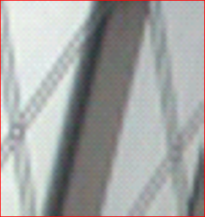

# VDSR-TensorFlow

---

## Introduction

This repository is TensorFlow implementation of VDSR (CVPR16). 

You can see more details from paper and author's project page

- Project page : [VDSR page](<https://cv.snu.ac.kr/research/VDSR/>)

- Paper : ["Accurate Image Super-Resolution Using Very Deep Convolutional Network"](<https://cv.snu.ac.kr/research/VDSR/VDSR_CVPR2016.pdf>)

---

## Network Structure

>  VDSR-TensorFlow/model/network.py

- **ILR** denotes Interpolated Low Resolution image
- **SR** denotes reconstructed super resolution image

### Details

- VDSR structures

| Layer (# layers)  | Filter size | Input Dimension | Output Dimension | Activation Function |
| ----------------- | ----------- | --------------- | ---------------- | ------------------- |
| Input Layer (1)   |  | 1               | 64               | ReLU                |
| Hidden Layer (18) |  | 64              | 64               | ReLU                |
| Output Layer (1)  |  | 64              | 1                | -                   |

> ReLU (Rectified Linear Unit)

- I/O 

| Input (LR)                                     | Output (Residual)                              | Reconstructed (LR + Residual)                  |
| ---------------------------------------------- | ---------------------------------------------- | ---------------------------------------------- |
|  |  |  |

---

## Training

### Loss Function

> **\_loss_function(self, reg_parameter)** in VDSR-TensorFlow/model/\_\__init\_\_.py

- Basic loss function

- Loss functions for **residual learning**

- Regularization

  - L2 regularization

  

  

- Notations
  -  : Weights in VDSR
  -  : ground truth (original high resolution image, HR)
  -  : interpolated low resolution image (ILR)
  -  : reconstructed super resolution image
  -  : residual between HR and ILR
    - 
  -  : regularization parameter
    -   : 0.0001

### Optimization

> **\_optimization_function(self, grad_clip, momentum_rate)** in VDSR-TensorFlow/model/\_\__init\_\_.py

- Optimization Method 

  - Stochastic Gradient Descent (SGD) method [[Wikipedia]](<https://en.wikipedia.org/wiki/Stochastic_gradient_descent>)
    - Momentum : 0.9

- Weight Initialization

  - He initialization [[paper]](<https://www.cv-foundation.org/openaccess/content_iccv_2015/papers/He_Delving_Deep_into_ICCV_2015_paper.pdf>)

- **Learning Rate**

  - Extremely high value is used to speed-up convergence rate
  - Initial Learning rate : 0.1

- **Learning Rate Decay**

   

  - Learning rate is decreased by factor of 10 for every 20 epochs

- **Adjustable Gradient Clipping**

  - Clip individual gradients to 
    -  denotes parameters for gradient clipping
    -  denotes learning rate

- Epochs : 80

---

## Data Set

### Training Data

> VDSR-TensorFlow/data/generate_dataset/train_data.m

- 291 images
  - Download from Author's page [[zip(train)]](https://cv.snu.ac.kr/research/VDSR/train_data.zip)
- Bicubic interpolation is used for LR data acquisition
- Data Augmentations (Rotation, flip) were used
- Scale Factor :  , 
- Patch size : 41
- Batch size : 64

### Testing Data

>  VDSR-TensorFlow/data/generate_dataset/test_data.m

- Set5, Set14, B100, Urban100
  - Download from Author's page [[zip(test)]](https://cv.snu.ac.kr/research/VDSR/test_data.zip)
- Bicubic interpolation is used for LR data acquisition
- Scale Factor : , , 

---

## Results

### Validation

PSNR performance plot on Set5

-  = 0.001

|  |  |  |
| ------------------------------------------------------------ | ------------------------------------------------------------ | ------------------------------------------------------------ |
| Scale 2                                                      | Scale 3                                                      | Scale 4                                                      |

-  = 0.0009

|  |  |  |
| ------------------------------------------------------------ | ------------------------------------------------------------ | ------------------------------------------------------------ |
| Scale 2                                                      | Scale 3                                                      | Scale 4                                                      |

-  = 0.0008

|  |  |  |
| ------------------------------------------------------------ | ------------------------------------------------------------ | ------------------------------------------------------------ |
| Scale 2                                                      | Scale 3                                                      | Scale 4                                                      |

### Objective Quality Assessment

#### Methods

- Bicubic Interpolation 
  - **imresize(..., ..., 'bicubic')** in Matlab
- VDSR (Original)
  - Author's MatConvNet implementation [[Code]](https://cv.snu.ac.kr/research/VDSR/VDSR_code.zip)
- VDSR (TensorFlow)
  - TensorFlow implementation
  - Train Details for Comparison
    - Gradient Clipping parameter  = 0.001
    - Data Augmentation
      - Rotation : 0°, 90°
      - Flip : left / right

#### Average PSNR/SSIM

> PSNR (Peak Signal-to-Noise Ratio)
>
> SSIM (Strutural SIMility)

---

-  = 0.001

- **Set5**

| scale                                                        | Bicubic        | VDSR (Original) | VDSR(TensorFlow) |
| ------------------------------------------------------------ | -------------- | --------------- | ---------------- |
|  | 33.68 / 0.9304 | 37.53 / 0.9586  | 37.07 / 0.9576   |
|  | 30.40 / 0.8682 | 33.66 / 0.9213  | 33.20 / 0.9171   |
|  | 28.43 / 0.8104 | 31.35 / 0.8838  | 30.90 / 0.8756   |

- **Set14**

| scale                                                        | Bicubic        | VDSR (Original) | VDSR(TensorFlow) |
| ------------------------------------------------------------ | -------------- | --------------- | ---------------- |
|  | 30.24 / 0.8693 | 33.05 / 0.9214  | 32.67 / 0.9108   |
|  | 27.54 / 0.7746 | 29.78 / 0.8318  | 29.58 / 0.8295   |
|  | 26.00 / 0.7029 | 28.02 / 0.7678  | 27.81 / 0.7627   |

- **B100**

| scale                                                        | Bicubic        | VDSR (Original) | VDSR(TensorFlow) |
| ------------------------------------------------------------ | -------------- | --------------- | ---------------- |
|  | 29.56 / 0.8442 | 31.90 / 0.8960  | 31.65 / 0.8943   |
|  | 27.21 / 0.7401 | 28.83 / 0.7976  | 28.66 / 0.7952   |
|  | 25.96 / 0.6697 | 27.29 / 0.7252  | 27.14 / 0.7217   |

- **Urban100**

| scale                                                        | Bicubic        | VDSR (Original) | VDSR(TensorFlow) |
| ------------------------------------------------------------ | -------------- | --------------- | ---------------- |
|  | 26.88 / 0.8410 | 30.77 / 0.9141  | 30.20 / 0.9087   |
|  | 24.46 / 0.7358 | 27.14 / 0.8279  | 26.69 / 0.8178   |
|  | 23.14 / 0.6588 | 25.18 / 0.7525  | 24.85 / 0.7406   |

---

-   = 0.0009
-  **Set5**

| scale                                         | Bicubic        | VDSR (Original) | VDSR(TensorFlow) |
| --------------------------------------------- | -------------- | --------------- | ---------------- |
|  | 33.68 / 0.9304 | 37.53 / 0.9586  | 37.14 / 0.9574   |
|  | 30.40 / 0.8682 | 33.66 / 0.9213  | 33.29 / 0.9171   |
|  | 28.43 / 0.8104 | 31.35 / 0.8838  | 30.95 / 0.8755   |

-  **Set14**

| scale                                         | Bicubic        | VDSR (Original) | VDSR(TensorFlow) |
| --------------------------------------------- | -------------- | --------------- | ---------------- |
|  | 30.24 / 0.8693 | 33.05 / 0.9214  | 32.74 / 0.9105   |
|  | 27.54 / 0.7746 | 29.78 / 0.8318  | 29.62 / 0.8291   |
|  | 26.00 / 0.7029 | 28.02 / 0.7678  | 27.84 / 0.7628   |

-  **B100**

| scale                                         | Bicubic        | VDSR (Original) | VDSR(TensorFlow) |
| --------------------------------------------- | -------------- | --------------- | ---------------- |
|  | 29.56 / 0.8442 | 31.90 / 0.8960  | 31.69 / 0.8936   |
|  | 27.21 / 0.7401 | 28.83 / 0.7976  | 28.68 / 0.7947   |
|  | 25.96 / 0.6697 | 27.29 / 0.7252  | 27.15 / 0.7214   |

-  **Urban100**

| scale                                         | Bicubic        | VDSR (Original) | VDSR(TensorFlow) |
| --------------------------------------------- | -------------- | --------------- | ---------------- |
|  | 26.88 / 0.8410 | 30.77 / 0.9141  | 30.29 / 0.9085   |
|  | 24.46 / 0.7358 | 27.14 / 0.8279  | 26.78 / 0.8186   |
|  | 23.14 / 0.6588 | 25.18 / 0.7525  | 24.90 / 0.7418   |

---

-   = 0.0008
-  **Set5**

| scale                                         | Bicubic        | VDSR (Original) | VDSR(TensorFlow) |
| --------------------------------------------- | -------------- | --------------- | ---------------- |
|  | 33.68 / 0.9304 | 37.53 / 0.9586  | 37.08 / 0.9574   |
|  | 30.40 / 0.8682 | 33.66 / 0.9213  | 33.19 / 0.9166   |
|  | 28.43 / 0.8104 | 31.35 / 0.8838  | 30.88 / 0.8743   |

-  **Set14**

| scale                                         | Bicubic        | VDSR (Original) | VDSR(TensorFlow) |
| --------------------------------------------- | -------------- | --------------- | ---------------- |
|  | 30.24 / 0.8693 | 33.05 / 0.9214  | 32.66 / 0.9105   |
|  | 27.54 / 0.7746 | 29.78 / 0.8318  | 29.54 / 0.8288   |
|  | 26.00 / 0.7029 | 28.02 / 0.7678  | 27.75 / 0.7617   |

-  **B100**

| scale                                         | Bicubic        | VDSR (Original) | VDSR(TensorFlow) |
| --------------------------------------------- | -------------- | --------------- | ---------------- |
|  | 29.56 / 0.8442 | 31.90 / 0.8960  | 31.65 / 0.8940   |
|  | 27.21 / 0.7401 | 28.83 / 0.7976  | 28.66 / 0.7945   |
|  | 25.96 / 0.6697 | 27.29 / 0.7252  | 27.14 / 0.7209   |

-  **Urban100**

| scale                                         | Bicubic        | VDSR (Original) | VDSR(TensorFlow) |
| --------------------------------------------- | -------------- | --------------- | ---------------- |
|  | 26.88 / 0.8410 | 30.77 / 0.9141  | 30.13 / 0.9076   |
|  | 24.46 / 0.7358 | 27.14 / 0.8279  | 26.68 / 0.8171   |
|  | 23.14 / 0.6588 | 25.18 / 0.7525  | 24.84 / 0.7402   |

---

### Visual Quality

- **"img002" of Urban100 for scale factor **
-   = 0.001

| Ground Truth                                                 | Bicubic                                                      | VDSR(TensorFlow)                                             |
| ------------------------------------------------------------ | ------------------------------------------------------------ | ------------------------------------------------------------ |
|  |  |  |
|  |  |  |

-   = 0.0009

| Ground Truth                                                 | Bicubic                                                      | VDSR(TensorFlow)                                             |
| ------------------------------------------------------------ | ------------------------------------------------------------ | ------------------------------------------------------------ |
|  |  |  |
|  |  |  |

-  = 0.0008

| Ground Truth                                                 | Bicubic                                                      | VDSR(TensorFlow)                                             |
| ------------------------------------------------------------ | ------------------------------------------------------------ | ------------------------------------------------------------ |
|  |  |  |
|  |  |  |

---

## Usage

> **On Windows**
>
> - run.bat
>
> **On Linux** 
>
> - run.sh

### Prerequisites

- **Python 3**

  > pip install -r requirements.txt

  - tensorflow
  - h5py
  - numpy + mkl
  - scipy
  - Pillow
  - skimage

- **Matlab** 

  - For data generation and performance evaluation
  - image processing toolbox

### Training Command

- in run.bat/sh
  - python main.py --model_name=vdsr **--is_train=True** --grad_clip=1e-3

    

If you want to change other parameters for training, please see the file

> VDSR-TensorFlow/model/configurations.py 

### Testing Command

in run.bat

python main.py --model_name=vdsr **--is_train=False**

### Trained checkpoint in experiments

- checkpoint 
  - Trained with  = 0.001 [[download]](https://drive.google.com/file/d/1wiej51wFY0oYsoKF7gGiWZT5_t5mFt0f/view?usp=sharing)
  - Trained with  = 0.0009 [[download]](https://drive.google.com/file/d/1LCicahSEcy3mrsC7okd2flOBCEqPDJ4w/view?usp=sharing)
  - Trained with  = 0.0008 [[download]](https://drive.google.com/file/d/1Mb2FcpRkUdGeRXspeH4LCq4bB6TQazW5/view?usp=sharing)

### Training dataset

- vdsr_train.h5
  - rotation=[0°, 90°], flip=[left / right] [[download]](https://drive.google.com/file/d/1o2oom_hVWLAY-RqUfPvvulj5sz_Kbphs/view?usp=sharing)

---

math equations are converted with [upmath.me](https://upmath.me/)